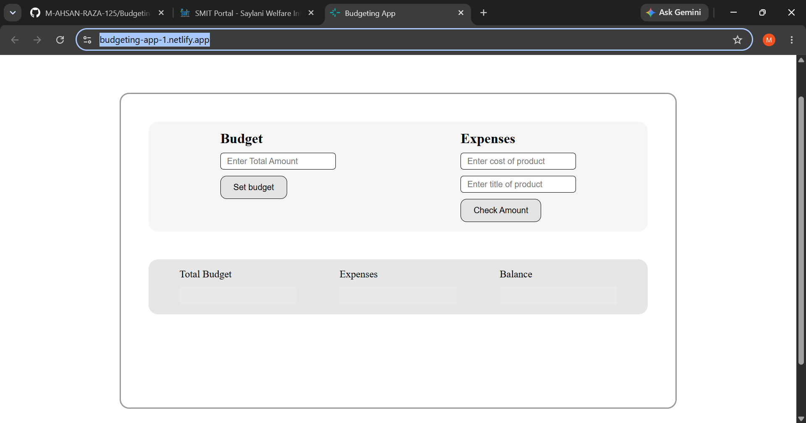

# 💰 Budgeting App

A simple and user-friendly **Budgeting App** built with HTML, CSS, and JavaScript.  
The application allows users to set a total budget, add expenses, and keep track of their remaining balance.

## 📸 Preview



## 🚀 Live Demo

👉 [View Budgeting App](https://budgeting-app-1.netlify.app/)

## ✨ Features

- 💵 Set your total budget
- 🧾 Add expenses with a product title and cost
- 📊 Track total expenses
- 💰 Calculate remaining balance
- ⚡ Instant calculations using JavaScript
- 🎨 Clean and simple user interface
- 📱 Easy-to-use layout

## 🛠️ Technologies Used

- HTML5
- CSS3
- JavaScript (ES6)

## 📸 Preview

The Budgeting App provides a simple interface where users can:

1. Enter their total budget.
2. Set the budget.
3. Enter an expense amount.
4. Enter the expense/product title.
5. Add the expense.
6. View the total budget, expenses, and remaining balance.

## ⚙️ How to Run Locally

1. Clone the repository:

```bash
git clone https://github.com/M-AHSAN-RAZA-125/Budgeting-App-JavaScript.git
